# Vehicle Detection and Tracking
**In this project, I built a software pipeline to detect vehicles in a video.**

## Pipeline architecture:
- **Data Loading and Visualization.**
- **Features Extraction**.
- **Classification Model.**
- **Vehicle Detection.**
- **Advanced Vehicle Detection.**
- **Video Processing.**

I'll explain each step in details below.

#### Environement:
-  Ubuntu 16.04
-  Anaconda 5.0.1
-  Python 3.6.2
-  OpenCV 3.1.0

---
## Step 1: Data Loading and Visualization

You can download the `vehicles` dataset from [here](https://s3.amazonaws.com/udacity-sdc/Vehicle_Tracking/vehicles.zip) and the `non_vehicles` dataset from [here](https://s3.amazonaws.com/udacity-sdc/Vehicle_Tracking/non-vehicles.zip)

These example images come from a combination of the [GTI vehicle image database](http://www.gti.ssr.upm.es/data/Vehicle_database.html), the [KITTI vision benchmark suite](http://www.cvlibs.net/datasets/kitti/), and examples extracted from the project video itself.

`Vehicle Images: 8792`

<figure>
 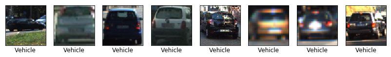
 <figcaption>
 

 
 </figcaption>
</figure>

<figure>
 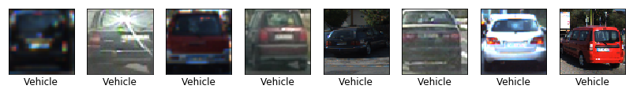
 <figcaption>
 

 
 </figcaption>
</figure>

<figure>
 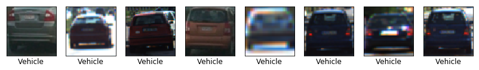
 <figcaption>
 

 
 </figcaption>
</figure>

<figure>
 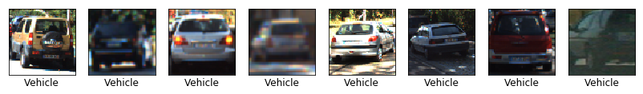
 <figcaption>
 

 
 </figcaption>
</figure>

`Non-Vehicle Images: 8968`

<figure>
 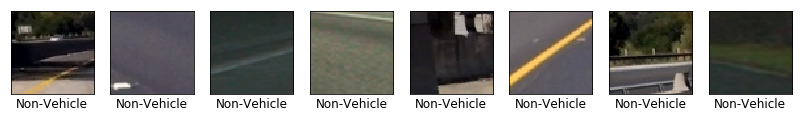
 <figcaption>
 

 
 </figcaption>
</figure>

<figure>
 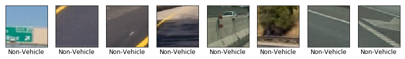
 <figcaption>
 

 
 </figcaption>
</figure>

<figure>
 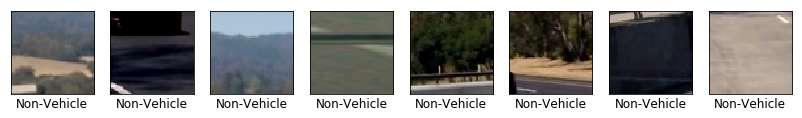
 <figcaption>
 

 
 </figcaption>
</figure>

<figure>
 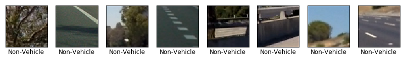
 <figcaption>
 

 
 </figcaption>
</figure>

---
## Step 2: Features Extraction

After loading the training set in the previous step, we will now extract the images' features. We'll extract three types of features:
- [Histogram of Oriented Gradients (HOG)](https://en.wikipedia.org/wiki/Histogram_of_oriented_gradients): Shape features.
We used a function called `get_hog_features` (Line 149 in `VehicleDetectionModel.py`) to extract the HOG features from the input image.

<figure>
 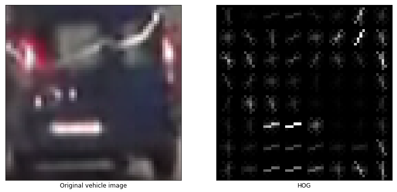
 <figcaption>
 

 
 </figcaption>
</figure>

<figure>
 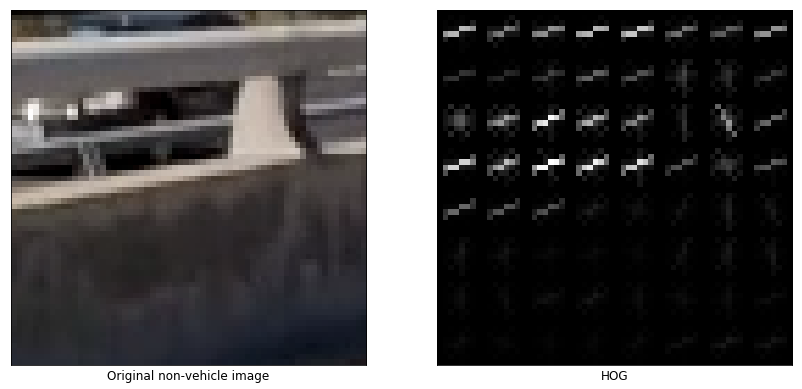
 <figcaption>
 

 
 </figcaption>
</figure>

And we also used `bin_spatial` function to compute the binned color features of the input image, and `color_hist` function to compute the color histogram features of the input image.

We defined sample parameters for feature extraction, and we'll test the classifier with different sets of parameters later.

`color_space = 'RGB'         # Can be RGB, HSV, LUV, HLS, YUV, YCrCb
orient = 9                  # HOG orientations
pix_per_cell = 8            # HOG pixels per cell
cell_per_block = 3          # HOG cells per block
hog_channel = 0             # Can be 0, 1, 2, or "ALL"
spatial_size = (16, 16)     # Spatial binning dimensions
hist_bins = 32              # Number of histogram bins
spatial_feat = True         # Spatial features flag
hist_feat = True            # Histogram features flag
hog_feat = True             # HOG features flag`

---
## Step 3: Classification Model

After extracting the images' features, we will now train a Linear Support Victor Clustering (LinearSVC) algorithm to classify the images to "vehicle" and "non-vehicle".

`
Using the sample parameters:

Feature vector length: 3780
Test Accuracy of SVC = 98.52 %
SVC training time: 10.86 seconds`

---
## Step 4: Vehicle Detection

Now, we'll define a sliding window function `slide_window` (Line 403 in `VehicleDetectionModel.py`) to generate a list of boxes with predefined parameters, and a `draw_boxes` function to draw the list of boxes on an image.

Basic sliding window algoritm was implemented. It allows to search for a car in a desired region of the frame with a desired window size (each subsamled window is rescaled to 64x64 px before classifing by the SVC). The window size and overlap should be wisely selected. Size of the window should be compared to the size of an expected car. These parameters were set to mimic perspective. These are some sample results for a fixed window size (128x128 px) and overlap for the provided test images:

<figure>
 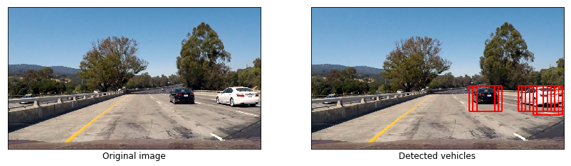
 <figcaption>
 

 
 </figcaption>
</figure>

<figure>
 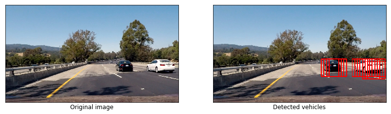
 <figcaption>
 

 
 </figcaption>
</figure>

<figure>
 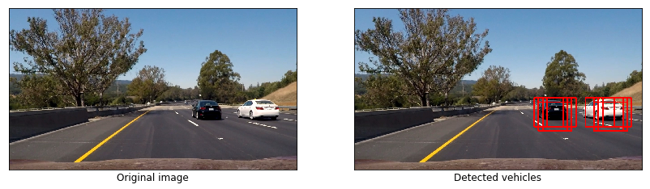
 <figcaption>
 

 
 </figcaption>
</figure>

### Deciding on feature extraction parameters:

Now, we need to decide which parameters we will use to extract the images' features. Our choices will hugely affect the classifier's performance. The parameters for features extraction were finetuned manually by try and error process so that it optimizes accuracy and computation time. We've tested the classifier performance using different parameters combinations to find out the best paramaters to use.

Please, refer to `Deciding on feature extraction parameters` for detailed presentation. This is the parameter set that gave the best results:

| Parameter              | Value   |
| :--------------------: | :-----: |
| color_space            | LUV     |
| Orientation bins       | 9       |
| Pixels per cell        | 8       |
| Cells per block        | 3       |
| HOG channel            | 0       |
| Spatial dimensions     | 16 x 16 |
| Histogram bins         | 32      |

`Vehicle features extracted: 17584 features.
Vehicle features extraction time: 29.19 seconds.
Non-Vehicle features extracted: 17936 features.
Non-Vehicle features extraction time: 30.04 seconds.
Feature vector length: 3780
Test Accuracy of SVC = 98.82 %
SVC training time: 9.35 seconds`

<figure>
 
 <figcaption>
 

 
 </figcaption>
</figure>

<figure>
 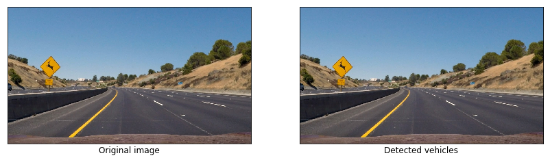
 <figcaption>
 

 
 </figcaption>
</figure>

<figure>
 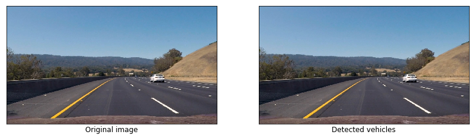
 <figcaption>
 

 
 </figcaption>
</figure>

<figure>
 
 <figcaption>
 

 
 </figcaption>
</figure>

<figure>
 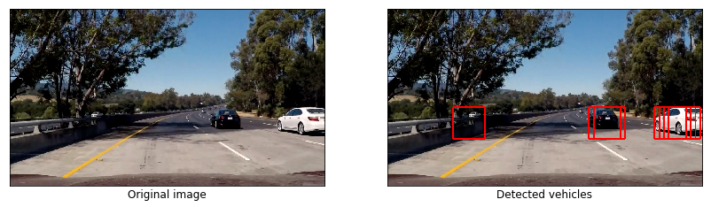
 <figcaption>
 

 
 </figcaption>
</figure>

<figure>
 
 <figcaption>
 

 
 </figcaption>
</figure>

As we can see on examples above, the classifier successfully finds cars on the test images. But the classifier failed to find a car on th 3rd image because it is too far to be detected. We will need to use multi scale windows to detect far away vehicles.
We will also need to apply a kind of filter (such as heat map) to avoid false positives (5th image) in video processing.

---
## Step 5: Advanced Vehicle Detection

### Show All Potential Search Areas

Becuase the size and position of cars in the image will be different depending on their distance from the camera, We will have to call `slide_window` a few times with different start/stop values. We will not scan with across the whole image, but only across areas where a new car can appear, and areas where a car was detected.

<figure>
 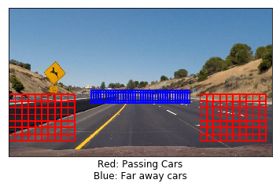
 <figcaption>
 

 
 </figcaption>
</figure>

### Refine detected car position

For every detected car we are doing to scan with a sliding window the ROI around the previous known position. We use multiple scales of windows in order to detect the car and its position more accurate and reliable.

<figure>
 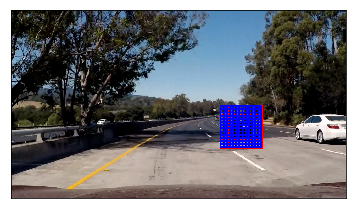
 <figcaption>
 

 
 </figcaption>
</figure>

### Lane Finding function

Here, we'll use `lane_detector` function from the [Advanced Lane Finding](https://github.com/mohamedameen93/Advanced-Lane-Finding-Using-OpenCV) project to detect lanes.

<figure>
 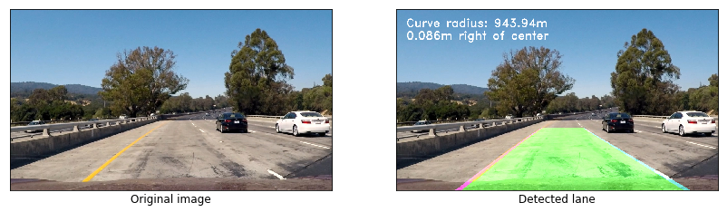
 <figcaption>
 

 
 </figcaption>
</figure>

<figure>
 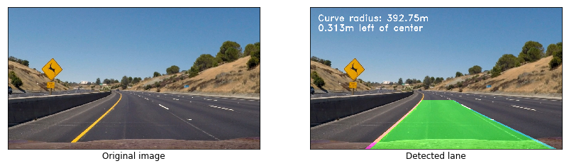
 <figcaption>
 

 
 </figcaption>
</figure>

<figure>
 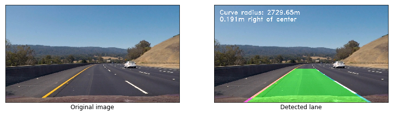
 <figcaption>
 

 
 </figcaption>
</figure>

<figure>
 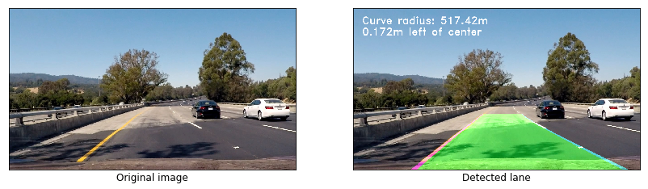
 <figcaption>
 

 
 </figcaption>
</figure>

<figure>
 
 <figcaption>
 

 
 </figcaption>
</figure>

<figure>
 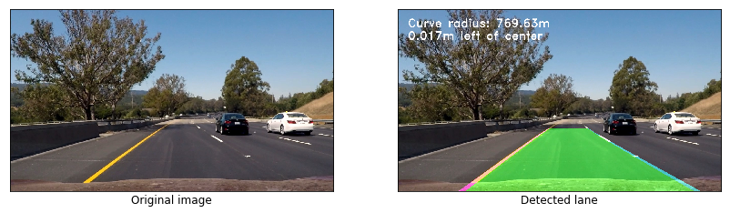
 <figcaption>
 

 
 </figcaption>
</figure>

### Example of processed images

<figure>
 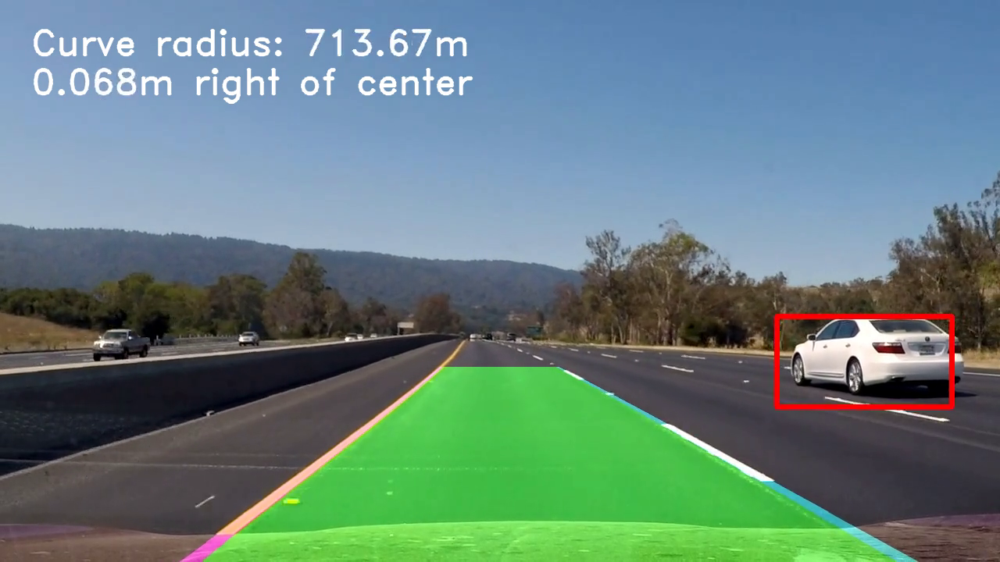
 <figcaption>
 

 
 </figcaption>
</figure>

<figure>
 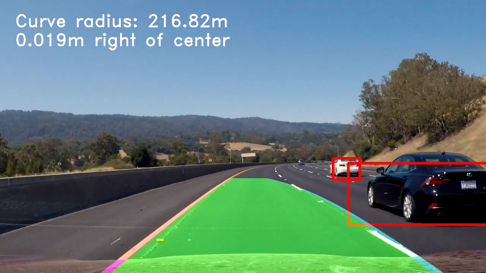
 <figcaption>
 

 
 </figcaption>
</figure>

<figure>
 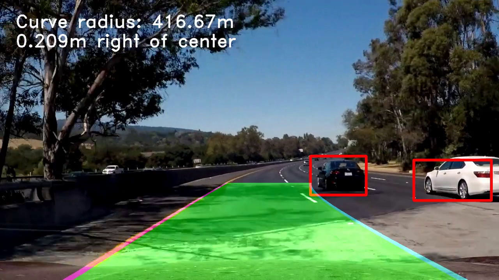
 <figcaption>
 

 
 </figcaption>
</figure>

---
## Step 6: Video Processing

Now, we'll build a pipeline to process the video frames.

### Multiple Detections & False Positives

We'll filter the found windows by a heatmap approach using `add_heat` function in order to combine overlapping detections, and we will apply threshold using `apply_threshold` function to remove false positives.

### Jitter Reduction

In order to reduce jitter (Smooth the car boxes), a function called `low_filter` applies a simple low-pass filter on the new and the previous cars boxes coordinates and sizes.

**Processing the project video:**

---
## Conclusion

- The pipeline was able to correctly label vehicles in the project video.

- The algorithm may diffenately fail in case of difficult light conditions, which could be partly resolved by using a more robust classifier, like the Yolo model for example.

- It is possible to improve the classifier by additional data augmentation, and further parameter tuning.

- The algorithm may have difficulties in classifying overlapping vehicles. To resolve this problem, we may introduce long term memory of the vehicle's position and a kind of predictive algorithm which can predict where occluded vehicle can be.

- To eliminate false positives on areas out of the road, we can integrate the results from the [Lane Finding project](https://github.com/mohamedameen93/Advanced-Lane-Finding-Using-OpenCV) to correctly determine the wide ROI on the whole frame by the road boundaries.